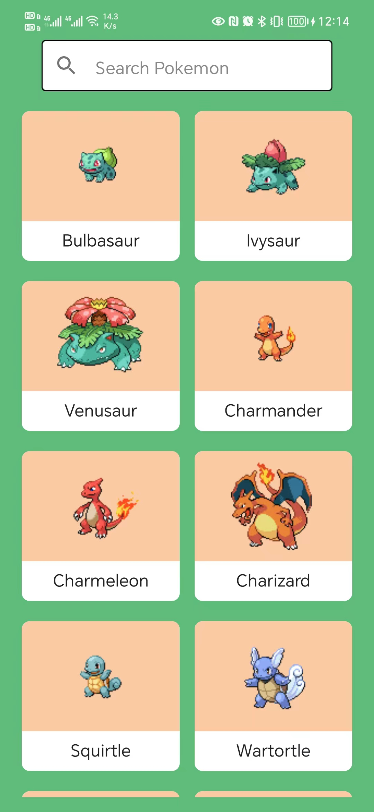
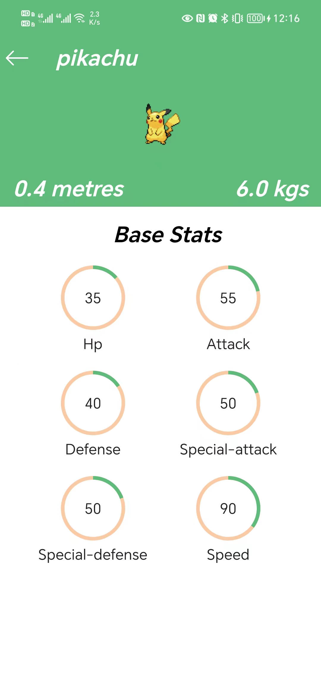

# pokemon Compose

一个使用Jetpack Compose编写的宝可梦图鉴，项目采用单Activity+ComposeNavigation进行路由跳转，
接口数据来源于[pokeapi](https://pokeapi.co/)

# 主要参考项目

Jetpack Compose仿写网易云音乐
[NCMusic](https://github.com/sskEvan/NCMusic);  
一个使用原生xml kotlin写的宝可梦图鉴
[PokeApi-Pokedex](https://github.com/ronnieotieno/PokeApi-Pokedex);

# 主要开源框架
* [accompanist-pager](https://google.github.io/accompanist/pager/)

* [coil](https://github.com/coil-kt/coil)

* [hilt](https://developer.android.google.cn/training/dependency-injection/hilt-jetpack#compose)

* [paging3](https://developer.android.google.cn/topic/libraries/architecture/paging/v3-overview)

* [navigation-compose](https://developer.android.google.cn/jetpack/compose/navigation)

* [accompanist-systemuicontroller](https://google.github.io/accompanist/systemuicontroller/)

* [Retrofit](https://square.github.io/retrofit/) 

* [Kotlin Flow](https://developer.android.com/kotlin/flow) 

# 截图

|||
|:----:|:------------------------------------------:|

